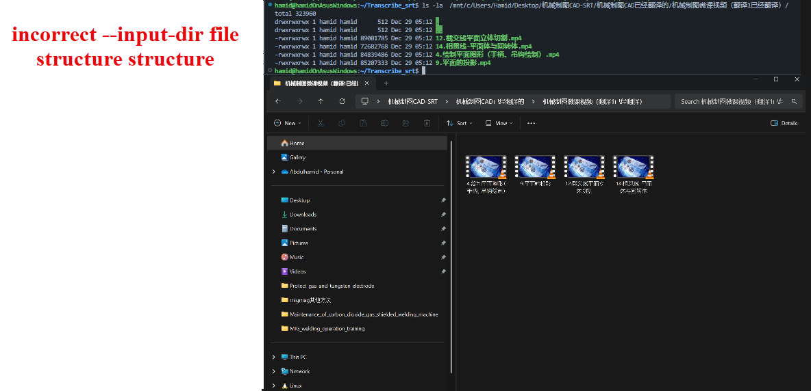
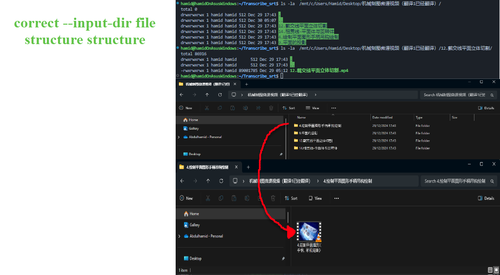

# Transcribe_video_to_srt_file
Transcribe_srt is a Python-based utility for generating .srt subtitle files from given video files. It can work with multiple video formats (e.g., .mp4, .mov, .avi, .mkv), and it can optionally detach subtitles, detach audio, or run speech-to-text (STT) to create transcripts.

## Table of Contents
- Features
- Prerequisites
- Installation
- Usage
- Command-Line Arguments
- Configuration
- Contributions
- License

## Features
- Generate Subtitles: Convert audio in video files (e.g., .mp4, .mov, .mkv, .avi) to .srt subtitle files.
- Detach Subtitles: If a video already contains subtitles, you can extract them as separate .srt files without re-encoding.
- Detach Audio: Optionally strip the audio from the video and save it as a separate .wav file.
- Speech-to-Text Integration: Utilize a speech-to-text API (e.g., Azure OpenAIs) for automatic speech recognition in multiple languages.
- Video Conversion: Automatically convert unsupported video formats (like .mov) to .mp4 for processing.
- Logging & Error Handling: Provides detailed logging for each step of the process.


## Prerequisites
1. Python >= 3.8: Make sure Python is installed and accessible.
2. ffmpeg: The script relies on ffmpeg for video and audio processing.
Installation instructions: [FFmpeg Downloads](https://ffmpeg.org/download.html).
3. pip: For installing Python dependencies.
4. Azure Account: If you plan to use the speech-to-text functionality, ensure you have valid API credentials.


## Installation
1. Clone the Repository:
```shell
git clone https://github.com/<your-username>/Transcribe_srt.git
cd Transcribe_srt
```
2. Install Python Dependencies:
```shell
pip install -r requirements.txt
```
(Adjust command if using pip3 or a virtual environment.)

3. Setup API Credentials:
- Place your API credentials (e.g., Azure secrets) into a .env file under the directory specified by --secrets-dir.
- Example .env contents
```shell
cat secrets/.env
>>>AZURE_OPENAI_API_KEY=
>>>AZURE_OPENAI_ENDPOINT=
>>>AZURE_OPENAI_DEPLOYMENT=
```
- For more details, refer to [Configuration](https://chatgpt.com/c/676fb84c-00c4-8000-9f5c-c754d48d5674#configuration).


## Usage
```shell
python transcribe_zh_en_p1.py --input-dir  /mnt/c/Users/Hamid/Desktop/（翻译后）焊接方法及设备使用课程视频-S --output-dir /mnt/c/Users/Hamid/Desktop/（翻译后）焊接方法及设备使用课程视频-SRT  --detach-subtitles --detach-audio --device gpu  --speech-to-text en --filter-two-stems --secrets-dir /home/hamid/secrets
```

### Command-Line Arguments
--input-dir: (Required) Path to the directory containing original videos.
--output-dir: Path to the directory where processed videos and files will be saved.
Defaults to parent directory of --input-dir if not provided.
--detach-subtitles: Flag to extract existing subtitles from videos (if present).
--detach-audio: Flag to extract audio tracks from videos as .wav.
--speech-to-text <LANG_CODE>: Perform speech-to-text on extracted audio in the specified language (e.g., en, es, fr).
--filter-two-stems: Attempt to separate audio into vocals and accompaniment (for improved STT quality).
--secrets-dir: (Required) Directory containing .env file with API credentials.
--device <cpu|gpu>: Specify device for audio processing, this is used only in the filteration process of demucs utility. Defaults to cpu.

### input-dir file structure
- inorder to ensure that transcribe_zh_en_p1.py runs smoothly we need to ensure that -input-dir contains subdirectories. and each subdirectory contains a video.





- If you are struggling with creating these directories manually. do not worry we've got you covered. please install:
```shell
pip install create_directory_for_each_video_inside_input_dir.py
```

## Logging
By default, the script logs important events and errors:
INFO: Start and end of processing, intermediate steps.
WARNING/ERROR: Subprocess or API errors, missing credentials, incompatible file types, etc.
To customize logging behavior (e.g., to enable DEBUG level), edit the logging.basicConfig(...) in the Python script.

## Roadmap
 Support additional speech-to-text providers (AWS, Google Cloud).
 Improve multi-language STT support.
 Integrate advanced noise reduction techniques.
 Create a Docker image for easier deployment.


## Contributing
Contributions, issues, and feature requests are welcome!
Feel free to open an issue or submit a pull request.

Fork the project
Create your feature branch (git checkout -b feature/my-feature)
Commit your changes (git commit -m 'Add some feature')
Push to the branch (git push origin feature/my-feature)
Open a Pull Request


## License
This project is licensed under the MIT License. You’re free to use, modify, and distribute this software as permitted by the license terms.


 


